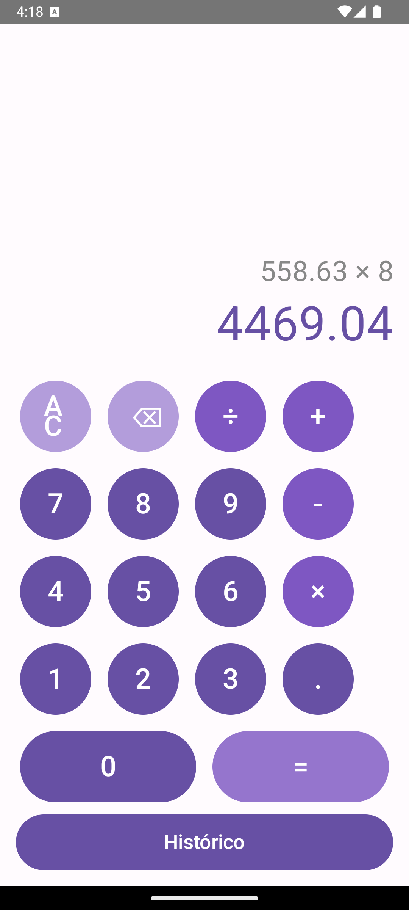
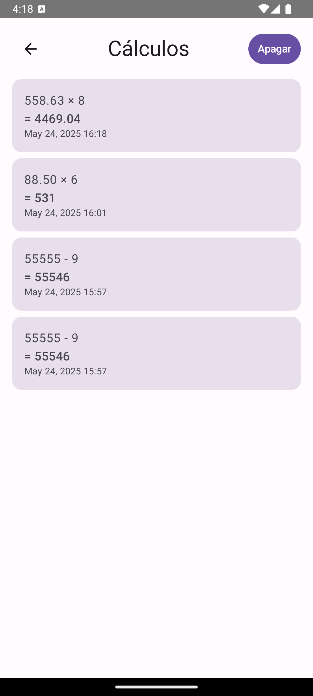

# CalculatorIn

Aplicativo de Calculadora Android Nativo com Histórico Persistente

## Descrição
Este projeto é uma calculadora moderna desenvolvida em Kotlin para Android, utilizando as melhores práticas do ecossistema Android e arquitetura Clean Architecture. O app permite realizar operações aritméticas básicas, exibe o resultado em tempo real e mantém um histórico persistente de cálculos, que pode ser consultado e apagado pelo usuário.

---

## Funcionalidades
- **Operações básicas:** Adição, subtração, multiplicação e divisão
- **Interface moderna:** Desenvolvida com Jetpack Compose e Material 3
- **Histórico persistente:** Todos os cálculos são salvos localmente usando Room Database
- **Gerenciamento de estado reativo:** ViewModel, StateFlow e UIState
- **Navegação entre telas:** Navigation Compose
- **Modo claro/escuro:** Suporte automático
- **Acessibilidade:** Botões grandes, labels e navegação intuitiva
- **Testes unitários:** Para lógica de cálculo

---

## Arquitetura e Tecnologias Utilizadas

### Linguagem
- **Kotlin**

### UI
- **Jetpack Compose**: Framework declarativo para construção de interfaces modernas e reativas
- **Material 3**: Componentes visuais modernos e suporte a temas

### Arquitetura
- **Clean Architecture**: Separação em camadas (domain, data, presentation) para maior testabilidade e manutenção
- **ViewModel**: Gerenciamento de estado e lógica de UI
- **StateFlow**: Fluxo reativo de dados entre ViewModel e UI

### Persistência
- **Room Database**: Banco de dados local SQLite com DAO e Entities para histórico de cálculos

### Injeção de Dependência
- **Hilt**: Framework oficial do Google para DI no Android

### Navegação
- **Navigation Compose**: Navegação declarativa entre telas

### Testes
- **JUnit**: Testes unitários para lógica de cálculo
- **MockK**: Mock para testes
- **Kotlinx Coroutines Test**: Testes de corrotinas

### Outras Ferramentas
- **Gradle Kotlin DSL**: Configuração do projeto
- **Android Studio**: IDE recomendada

---

## Estrutura do Projeto

```
app/
 └── src/main/java/com/example/calculatorin/
      ├── domain/         # Lógica de negócio (Calculator, use cases)
      ├── data/           # Room, entidades, DAO, banco de dados
      ├── di/             # Módulos de injeção de dependência (Hilt)
      ├── presentation/   # UI, ViewModels, navegação
      └── CalculatorApp.kt# Classe Application (Hilt)
```

---

## Como Executar
1. **Clone o repositório:**
   ```
   git clone <url-do-repositorio>
   ```
2. **Abra no Android Studio**
3. **Rode em um emulador ou dispositivo físico**
4. **Compile e execute**

---

## Instruções de Uso
- Digite a expressão usando os botões.
- O resultado aparece em tempo real.
- Clique em `=` para finalizar e salvar no histórico.
- Clique em "Histórico" para ver todos os cálculos anteriores.
- Use o botão "Apagar" para limpar todo o histórico.
- Após clicar em `=`, ao digitar um novo número, a calculadora inicia um novo cálculo.

---

## Requisitos
- Android Studio Flamingo ou superior
- SDK Android 24+
- Kotlin 1.9+

---

## Licença
MIT



